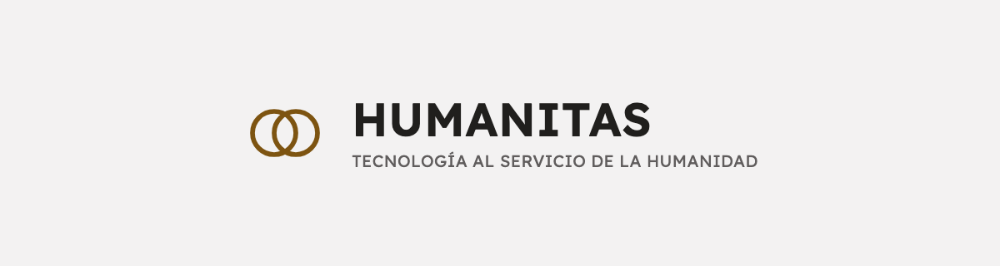
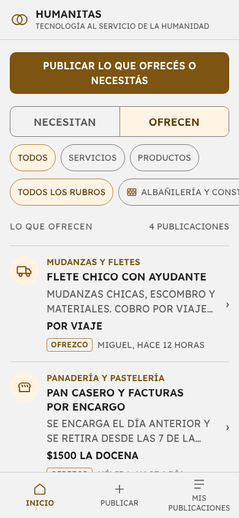
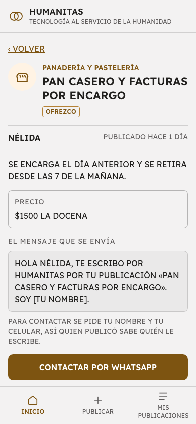
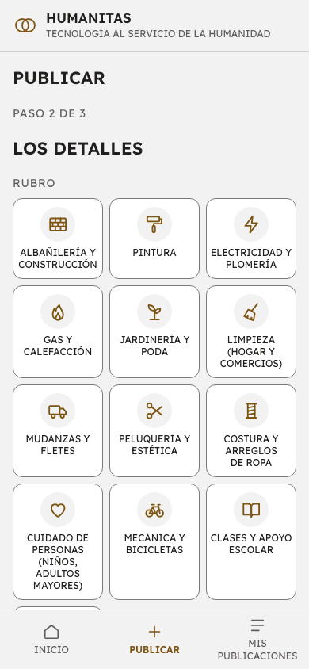
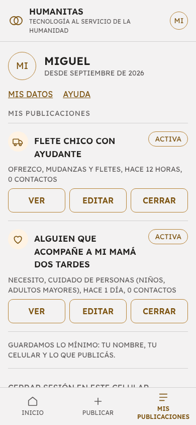

<p align="center">
  
</p>

Humanitas es una app web para personas, entre personas. Acerca a quien ofrece un trabajo o un producto y a quien lo necesita. Se mira sin cuenta, se contacta por WhatsApp y cada acuerdo queda en manos de las personas: la app no cobra comisiones ni intermedia pagos.

Está pensada para las personas del **norte de la ciudad de Santa Fe**, Argentina.

Está pensada para celulares de gama baja, con poca señal, y para personas que leen con esfuerzo. Por eso usa letra mayúscula de imprenta y un dibujo para cada oficio, y pesa 189 KB la primera vez. Es una PWA: no hace falta instalar nada.

## Cómo se ve

| El listado | Una publicación |
|---|---|
|  |  |

| Publicar | Mis publicaciones |
|---|---|
|  |  |

## Documentación

| Documento | Qué tiene |
|---|---|
| [Producto](docs/producto.md) | Qué es, para quién, cómo funciona, pantallas, principios e identidad. |
| [Requerimientos](docs/requerimientos.md) | Qué está cumplido, dónde y con qué test. Decisiones que cambiaron el requerimiento. Pendientes. |
| [Arquitectura](docs/arquitectura.md) | Piezas, modelo de datos y diagramas de secuencia de cada flujo. |
| [Seguridad](docs/seguridad.md) | Qué protege la app, cómo se verifica, auditoría y checklist de producción. |
| [Dependencias y servicios](docs/dependencias.md) | Qué usa, qué cuesta ($0) y con qué licencia. |
| [Operación](docs/operacion.md) | Deploy, variables de entorno, tareas del equipo, monitoreo. |
| [Guía visual](docs/guia-visual.md) | Paleta, tipografía, componentes, tono y citas verificadas. |
| [CLAUDE.md](CLAUDE.md) | Reglas para desarrollar y registro de decisiones. |

## Stack

- **Next.js 16** (App Router, TypeScript, Tailwind) en **Vercel Hobby**, región San Pablo.
- **Supabase Free**, solo como Postgres + Storage. Solo el servidor le habla.
- Autenticación propia: nombre y celular, sin contraseña. Token en una cookie httpOnly y solo su hash en la base.
- Tests con **Vitest** contra Supabase local.

Costo de infraestructura: **$0**.

## Empezar

Requisitos: **nvm** con Node 22, **Docker Desktop** abierto y la **Supabase CLI** (`brew install supabase/tap/supabase`).

```bash
nvm use                 # Node 22, fijado en .nvmrc
npm install
supabase start          # Postgres + Storage locales
```

Creá `.env.local` a partir de [.env.example](.env.example). En local, la clave de servicio se lee del contenedor de Storage:

```bash
KEY=$(docker inspect supabase_storage_humanitas --format '{{range .Config.Env}}{{println .}}{{end}}' | sed -n 's/^SERVICE_KEY=//p')
printf 'SUPABASE_URL=http://127.0.0.1:54321\nSUPABASE_SERVICE_ROLE_KEY=%s\nSAL_IP=%s\n' "$KEY" "$(openssl rand -hex 32)" > .env.local
```

Esa clave es la de demostración de Supabase local y no sirve fuera de tu máquina.

```bash
npm run dev             # http://localhost:3000
npm test                # 143 tests
supabase stop           # al terminar; los datos se conservan
```

`supabase db reset` vuelve la base local a cero, con las migraciones y los datos de ejemplo.

## Comandos

| Comando | Qué hace |
|---|---|
| `npm run dev` | App en desarrollo. |
| `npm test` | Tests (necesita Supabase local). |
| `npm run lint`, `npm run typecheck` | Revisión del código y de los tipos. |
| `npm run build` | Build de producción. |
| `npm run chequear:secretos` | Después del build, confirma que ninguna clave llegue al navegador. |
| `npm run chequear:dependencias` | `npm audit`. |
| `npm run baja -- "<celular>" "<operador>"` | Da de baja una cuenta y borra sus datos. |
| `npm run respaldar` | Respaldo de la base de producción. |
| `npm run podar:limites` | Borra los intentos por conexión de más de 2 días. |

## Estructura

```
app/                  Pantallas y server actions
lib/                  Lógica, acceso a datos, sesión y seguridad
proxy.ts              Cabeceras de seguridad y sesión, antes de cada pantalla
supabase/migrations/  Esquema, reglas y funciones (iguales en local y en la nube)
scripts/              Tareas del equipo
tests/                Tests
docs/                 Documentación
```

## Licencia

MIT: ver [LICENSE](LICENSE). Si encontrás una falla de seguridad, mirá [SECURITY.md](SECURITY.md).

## Estado

En funcionamiento. Lo que falta está en [Requerimientos → Pendientes](docs/requerimientos.md#pendientes).
