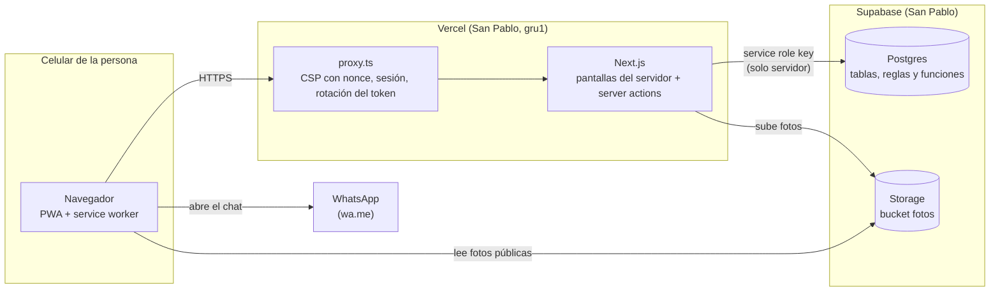
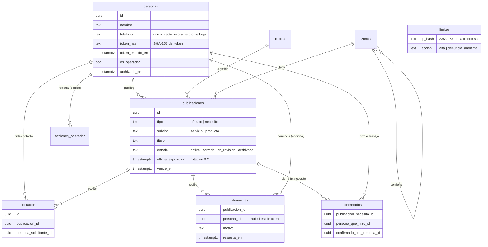
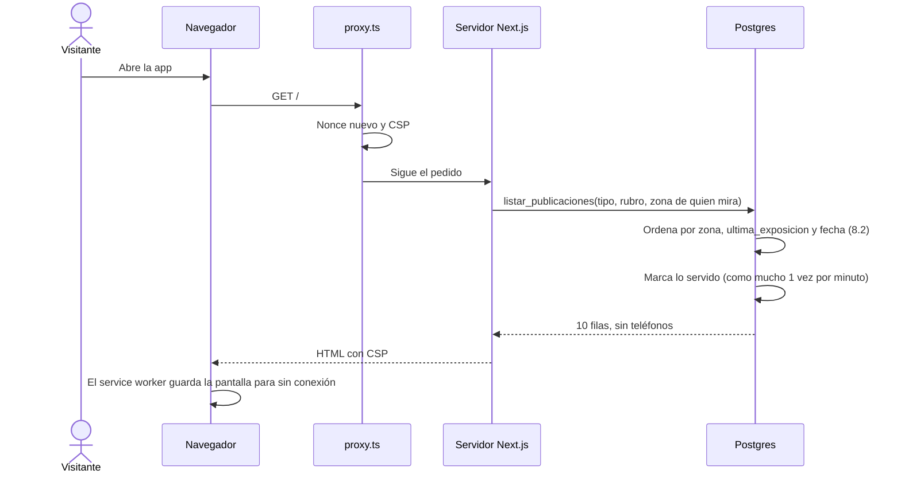
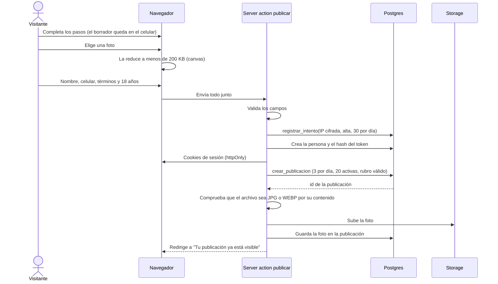
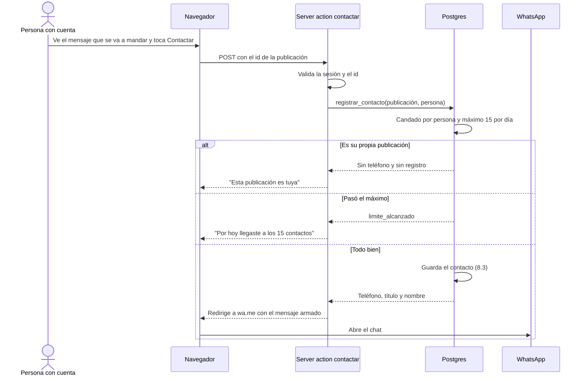
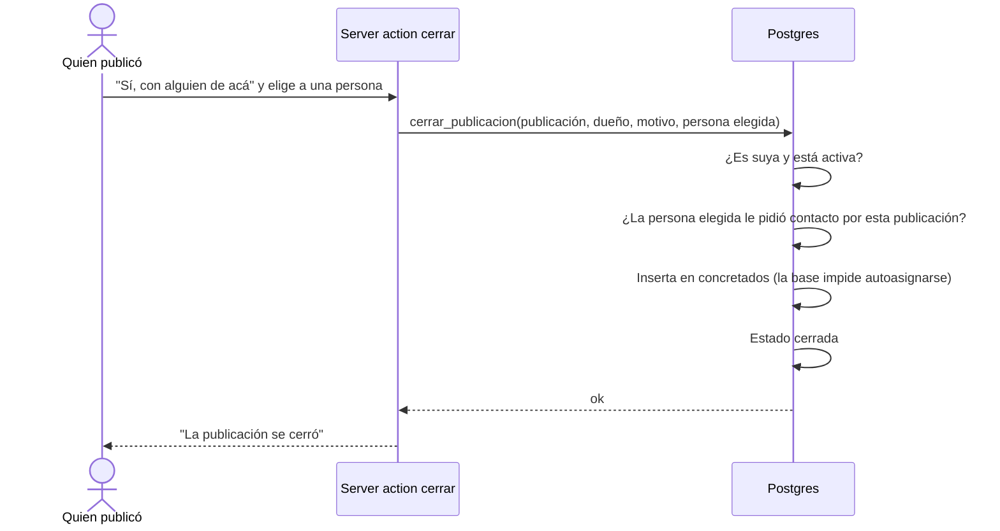
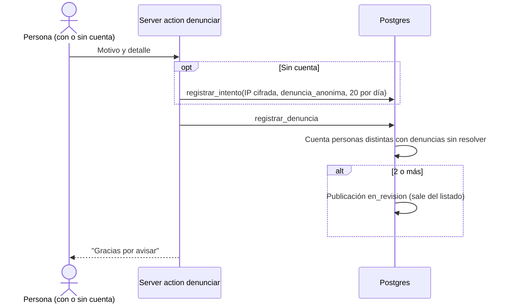
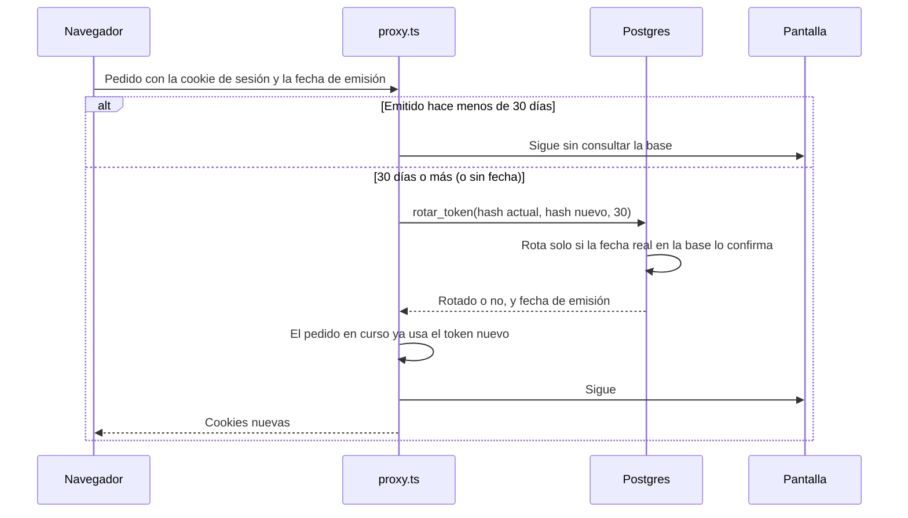
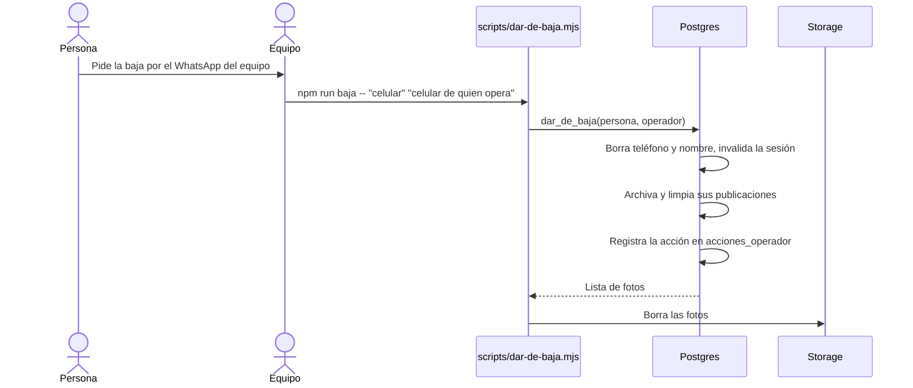

# Arquitectura

Cómo está hecha Humanitas por dentro: las piezas, el modelo de datos y cómo viaja la información en cada flujo. Los diagramas usan Mermaid, que GitHub muestra dibujados.

## Vista general

Humanitas es **un monolito** Next.js: las pantallas y el servidor viven en el mismo proyecto. La base de datos y el almacenamiento de fotos son de Supabase, pero **solo el servidor les habla**. El navegador nunca recibe una clave ni se conecta a Supabase.



### Principios

- **La base hace cumplir las reglas.** Los límites anti-abuso, el orden del listado, los concretados y las denuncias viven en funciones SQL con candados (`pg_advisory_xact_lock`). La app no puede saltearlas aunque tenga un error.
- **Nada se borra.** Los triggers `*_sin_delete` rechazan DELETE y TRUNCATE en todas las tablas. Las únicas excepciones son `eventos` y `limites`, que se podan con scripts manuales.
- **El teléfono no sale.** Solo lo lee la función `registrar_contacto`, en el servidor, para armar el link `wa.me`.
- **Supabase cerrado.** RLS activo sin políticas y sin permisos para `anon` ni `authenticated`: con la clave pública no se lee ni se escribe nada.

## Código

```
app/                      Pantallas (App Router) y server actions
  page.tsx                Listado (inicio)
  p/[id]/                 Detalle, contactar, denunciar
  publicar/               Publicar en pasos + alta embebida
  alta/                   Alta mínima
  mis-publicaciones/      Perfil, cerrar, reactivar, editar, mis datos, cerrar sesión
  ayuda/, terminos/       Páginas de texto
  componentes/            Encabezado, barra inferior, oficios dibujados, avisos, citas
  api/health/             Chequeo de disponibilidad
lib/                      Lógica: validaciones, acceso a datos, sesión, seguridad
  supabase/servidor.ts    Único cliente de Supabase (server-only, service role)
  sesion/                 Token, cookie, rotación
  seguridad/              Cabeceras, CSP, límites por conexión
proxy.ts                  Corre antes de cada pantalla
supabase/migrations/      Esquema, reglas y funciones (iguales en local y en la nube)
supabase/seed.sql         Datos de ejemplo, solo en local
scripts/                  Tareas del equipo (baja, respaldo, poda, chequeo de secretos)
tests/                    Vitest contra Supabase local
public/sw.js              Service worker (modo sin conexión)
```

## Modelo de datos

Las tablas son exactamente las de la sección 12.3 del requerimiento, más `limites` (11.5, seguridad).



También existen `referentes`, `eventos`, `eventos_mensuales` y `acciones_operador`. `referentes` y los campos `verificado_*` quedan sin uso desde el 18/09/2026 (sin verificación presencial). `eventos` todavía no se llena.

## Flujos

### Mirar el listado (sin cuenta)



### Publicar sin cuenta, con foto



La publicación se crea **antes** de subir la foto: si la base la rechaza por un límite, no queda ninguna foto suelta en el Storage.

### Contactar por WhatsApp



El teléfono solo existe dentro de ese redirect. No aparece en ninguna pantalla ni en ninguna respuesta.

### Cerrar un "necesito" y reconocer el trabajo



### Denunciar



Las denuncias sin cuenta quedan registradas para el equipo, pero no alcanzan para ocultar una publicación.

### Sesión: renovación cada 30 días



Cerrar sesión reemplaza el hash en la base: la cookie vieja deja de servir aunque alguien la haya copiado.

### Baja de una cuenta (Ley 25.326)



## Rendimiento

- **Primera carga:** 189 KB comprimidos, de un máximo de 300 KB (R13). Lexend pesa 39 KB y la sirve el propio dominio.
- **Región:** la app (Vercel) y la base (Supabase) están en San Pablo, así las consultas no cruzan el continente.
- **Sin conexión:** el service worker guarda los archivos de la app y la última pantalla vista. Nunca guarda nada de `/api`, `/alta`, `/publicar` ni `/mis-publicaciones`, y al cerrar sesión borra lo guardado.
