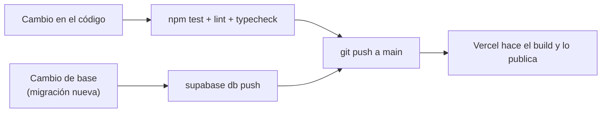

# Operación

Cómo se deploya, qué variables usa y qué tareas hace el equipo. Pensado para quien mantiene la app día a día.

## Entornos

| | Local | Producción |
|---|---|---|
| App | `npm run dev` → http://localhost:3000 | Vercel, se deploya sola con cada push a `main` |
| Base | Supabase local (Docker) | Supabase `terwvgvhbdeikkwknerg` (San Pablo) |
| Datos | `supabase/seed.sql`: una zona y personas de ejemplo | Vacía, solo los rubros |
| Variables | `.env.local` (nunca va a git) | Vercel → Project Settings → Environment Variables |

## Variables de entorno

Todas se usan **solo en el servidor**. Ninguna lleva el prefijo `NEXT_PUBLIC_` (un test lo controla).

| Variable | Qué es | Obligatoria |
|---|---|---|
| `SUPABASE_URL` | URL del proyecto de Supabase. | Sí |
| `SUPABASE_SERVICE_ROLE_KEY` | Clave secreta de Supabase (`sb_secret_…` o `service_role`). Da acceso total a la base. | Sí |
| `SAL_IP` | Texto al azar para cifrar las IP de los límites por conexión (`openssl rand -hex 32`). | Sí en producción |
| `WHATSAPP_EQUIPO` | Celular del equipo para la pantalla Ayuda. Si falta, Ayuda lo dice. | No |

## Deploy



1. **Antes de subir:**
   ```bash
   npm test && npm run lint && npm run typecheck
   npm run build && npm run chequear:secretos
   npm run chequear:dependencias
   ```
2. **Si hay una migración nueva**, aplicarla en la nube **antes** del push, así el código nuevo encuentra la base lista:
   ```bash
   supabase db push      # usa el proyecto vinculado con `supabase link`
   ```
   Las migraciones son las mismas en local y en la nube. No se edita una migración que ya se aplicó: se crea otra.
3. **Subir:** `git push`. Vercel deploya solo.
4. **Revisar en producción:** que abra el inicio, que `/api/health` responda `{"ok":true}` y que las cabeceras de seguridad estén (`curl -I https://…`).

### Volver atrás

En Vercel → Deployments, el deploy anterior → **Promote to Production**. Si el problema es de una migración, se corrige con una migración nueva: la base no se vuelve atrás a mano.

## Tareas del equipo

| Tarea | Cuándo | Cómo |
|---|---|---|
| Respaldo de la base | Una vez por semana | `npm run respaldar` → `respaldos/` (fuera de git; guardarlo cifrado). Necesita Docker abierto: la CLI usa `pg_dump` en un contenedor. |
| Poda de intentos por conexión | Una vez por mes | `npm run podar:limites` |
| Dar de baja a alguien | Cuando lo pide por el WhatsApp del equipo | `npm run baja -- "<celular>" "<celular de quien opera>"` |
| Revisar dependencias | Antes de cada deploy | `npm run chequear:dependencias` |
| Resolver una denuncia | Cuando una publicación queda en revisión | ⏳ Script pendiente (función `resolver_revision` lista) |
| Devolver el acceso | Cuando alguien cambió de celular | ⏳ Script pendiente |

Los scripts leen `.env.local`. Para operar sobre producción, correrlos con las variables de producción en el entorno, nunca pegándolas en archivos del repositorio.

### Cuenta de operador

Las tareas del equipo necesitan una persona con `es_operador = true`, que queda registrada en `acciones_operador` cada vez que actúa. Se crea una sola vez: la persona del equipo se da de alta en la app con su celular y después se la marca como operadora desde el editor SQL de Supabase:

```sql
update personas set es_operador = true where telefono = '549342XXXXXXX';
```

## Monitoreo

- **`/api/health`** devuelve `200 {"ok":true,"base":"ok"}` si la base responde, y `503` si no. Conectarlo a un pinger gratuito cada 5 minutos: avisa si la app se cae y evita que Supabase Free pause el proyecto.
- **Logs:** Vercel → Project → Logs.

## Desarrollo local

```bash
nvm use
supabase start          # necesita Docker Desktop abierto
npm run dev             # http://localhost:3000
npm test
supabase stop           # al terminar; los datos se conservan
```

`supabase db reset` vuelve la base local a cero con las migraciones y el seed.
